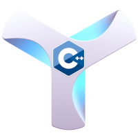

# symbol-sdk-cpp

TL; DR: Foundation C++ library for:
  * using the NEM's Symbol Blockchain core (offline) algorithms, like key management and creating or signing transactions.
  * interacting with REST API nodes of the NEM's Symbol Blockchain.

## Why Symbol-sdk-cpp

The SDK Provides a foundation for C++ Application Development on the NEM's Symbol blockchain.

## High level components
```
           SYMBOL SDK component overview
┌────────────────────────────────────────────────┐
│                                                │
│           ┌──────────────────────────────────┐ │
│           │                                  │ │
│    core   │    ┌─────┐    use    ┌─────┐     │ │
│ (offline) │    │ lib │◄──────────┤ HMI │     │ │
│shared lib │    └─────┘           └─────┘     │ │
│           │        ▲               ▲         │ │
│           │        │               │         │ │
│           └────────┼───────────────┼─────────┘ │
│                    │  inheritance  │           │
│           ┌────────┼───────────────┼─────────┐ │
│           │        │               │         │ │
│    rpc    │    ┌───┴─┐           ┌─┴───┐     │ │
│ (online)  │    │ lib │◄──────────┤ HMI │     │ │
│shared lib │    └─────┘   use     └─────┘     │ │
│           │                                  │ │
│           └──────────────────────────────────┘ │
│                                                │
└────────────────────────────────────────────────┘
lib - core classes
classes for building applications

                   HMI Human-Machine-Interface
                   clases for console interaction
```


### Clone and configure:
```sh
git clone https://github.com/nemtech/symbol-sdk-cpp
cd symbol-sdk-cpp
scripts/configure.sh
```

Configure will clone catapult-server and cherry-pick files from it.

### Prerequisites on the supported Operating Systems

The library shall build on any platform supported by CMake. Currently, the following systems have been tested:

  * Debian / Ubuntu Linux
```
apt install g++ cmake git libboost1.74-all-dev
```

### Run-time dependencies:

Packages that are required before building symbol-sdk-core.

#### Debian / Ubuntu

```sh
sudo apt install cmake git g++
```

### Build-time dependencies:

Once configured proceed to build the project.

* nemtech/[catapult-server](https://github.com/nemtech/catapult-server "GitHub link")  -  Catapult core algorithms.
* mm-s/[restc-cpp](https://github.com/mm-s/restc-cpp "GitHub link")  -  branch marc-os. Patched original jgaa/[restc-cpp](https://github.com/jgaa/restc-cpp.

### Build:
Once configured proceed to build the project.

```sh
mkdir _build; cd _build
cmake  ..
make
```
You can pass options to cmake to specify alternative locations of the restc-cpp library using
```
cmake -DRESTCCPP_ROOT=<path_to_restc-cpp_cpp> ..
```
Paths shall point to a directory containing standard directories bin, lib and include.

## Install:
In order to install the library and cliente application in the system type:
```sh
sudo make install
```

CMake accepts the useful definition for specifying the install target location.
```sh
cmake -DCMAKE_INSTALL_PREFIX=<target_directory> ..
```

## Project Governance:
Ships: 
* branch main: 
  * Release Manager TBD

* branch dev:
  * developer marcos.mayorga@nem.software
  * [apply^]


